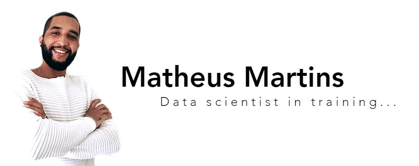

  

# Graduating in Big Data and Analytical Intelligence | Data Science, Machine Learning in training | Technology Enthusiast

I want to be part of the next digital revolutions, this time from the inside.

The processing of information relevant to our development has become a difficult task, entertainment generates a lot of information that, instead of helping, ends up making it difficult due to excess.

Today, studying 'data science', 'machine learning' techniques, 'big data' and others subjects that involve data, I realize that companies also have difficulties in transforming all this information into real values, which, without a doubt can determine the performance and consequently, the survival of a company, with that in mind and with a lot of love for knowledge, I will contribute shortly with my dynamism and with all the learning I have acquired over the years.

The engineering environment led me to solve problems, now in career transition, I want to take my effort into the data age. 

**Links:**
* [LinkedIn](www.linkedin.com/in/matheusfsm)
* [Medium](https://medium.com/@matheusfsm.mm)

## Projetos:

* **Analisando dados do Airbnb (Rio de Janeiro):** https://bit.ly/3cMsczE
* **Analisando dados de Acidentes de Trânsito (São Paulo):** https://bit.ly/2BQZkcO
* **Utilizando o bar_chart_race com os dados do Covid no Brasil:** https://bit.ly/2UQSSZZ
* **Analisando dados da violência (Rio de Janeiro):** https://bit.ly/2Y8XnRP
* **Primeiro projeto ML, Prediçao de tipos de vinhos:**https://bit.ly/2XTOICb
